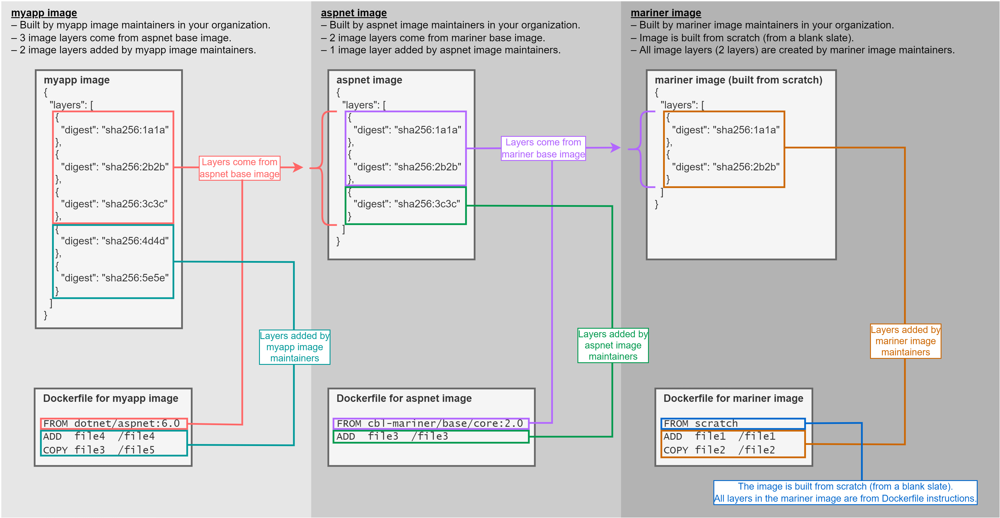
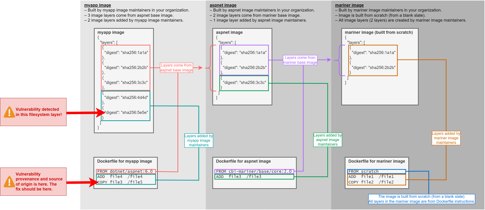
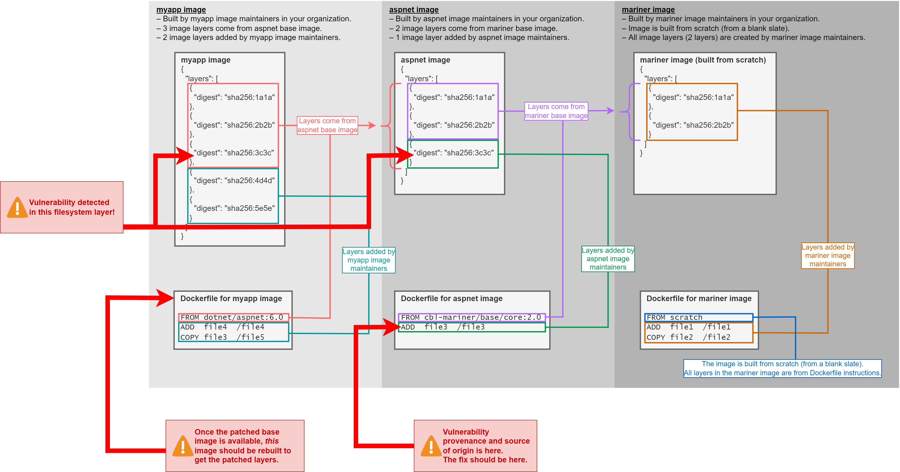
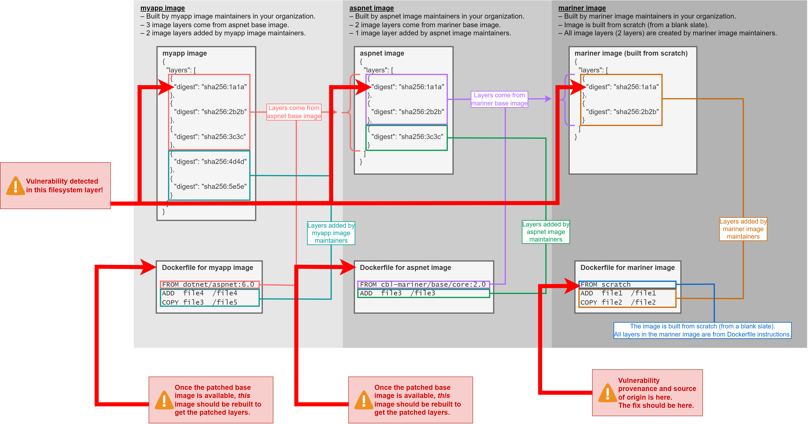
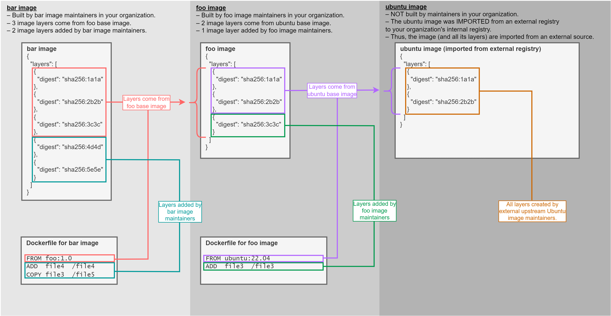
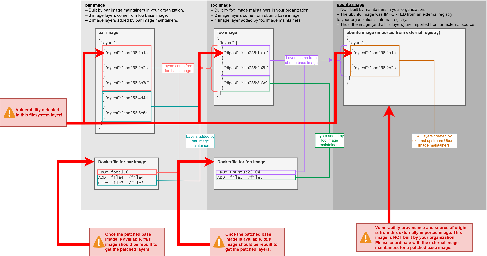
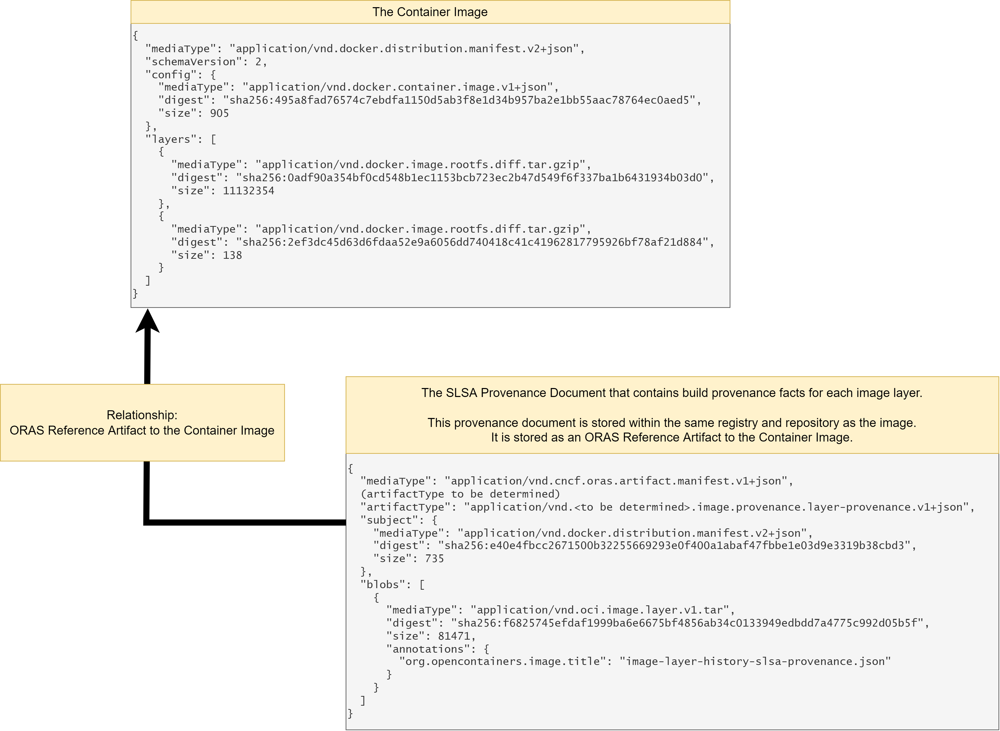
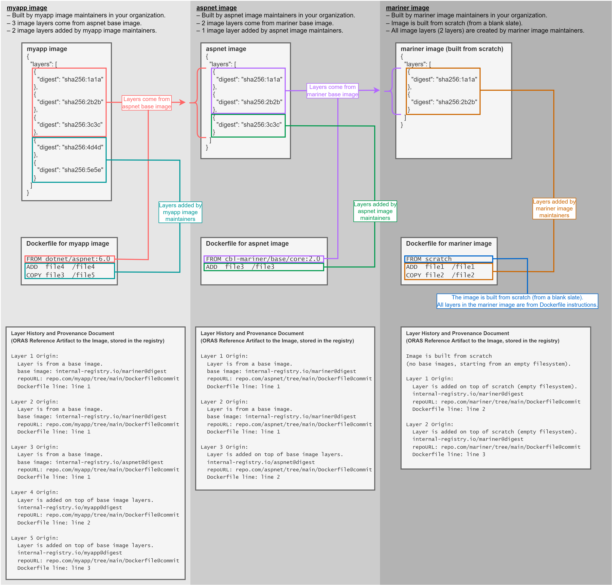
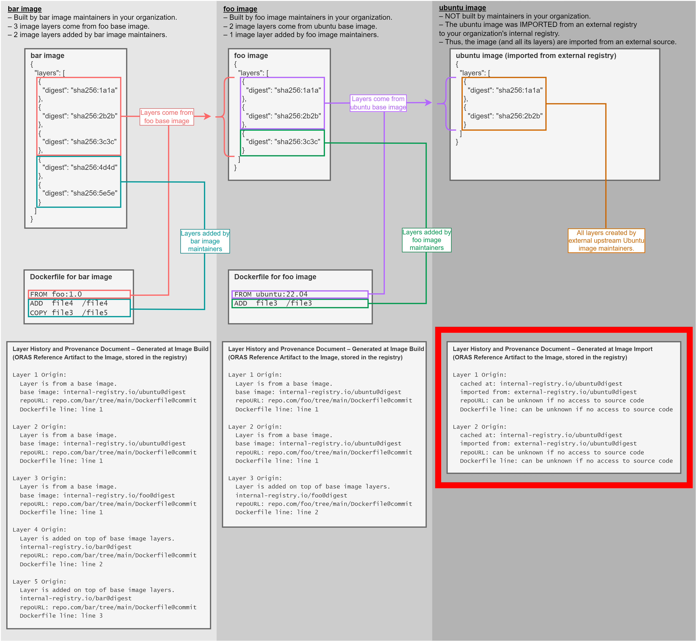

# Image Layer Provenance and Manifest Layer History

## Target Audience

This is for you if you are:

* A container image maintainer who frequently needs to fix image vulnerabilities found by scanners.
* Someone overwhelmed by image vulnerability scan results.
  * Scanning images turns up a lot of vulnerabilities.
  * A lot of vulnerabilities are **unactionable**, such as vulnerabilities in a base OS image that doesn't have a fix yet.
* A vulnerability responder who cannot determine "ownership" for fixing a detected vulnerability.
  * Current container image formats and vulnerability scan reports do not show the "provenance" (origin) of a vulnerable package (i.e., "how" a vulnerable package got into the image).
  * Complex CI/CD pipelines, multiple build engineering systems, and distributed teams are present in today's IT landscape.
  Without vulnerability provenance (origin information), responders and maintainers cannot determine which build step, repo, specific Dockerfile, or team introduced the vulnerability.
* An image maintainer or vulnerability responder that is only interested in **actionable** vulnerabilities. Image builders want to differentiate vulnerability alerts between the following 2 types:
    1. Vulnerabilities from base images – These require coordination with upstream base image maintainers for them to deliver a patched base image.
    2. Vulnerabilities from new layers introduced by the image builders – These can be immediately remediated and the fix can be rolled out.

## Problem

### Container Image History Limitations Prevent Fixing Vulnerabilities at Source of Origin

Image vulnerabilities have to be fixed at their source of origin.
However, there are limitations in the container image format and image build history that prevents this.

Image maintainers face (1) image format limitations, (2) image history obfuscation, and (3) lack of image build provenance.

Due to lack of image build provenance, when vulnerability scanners detect a vulnerability within a container image, scanners **cannot** determine the vulnerability's source of origin.
Simple answers such as the following cannot be reported in vulnerability scan reports:

* Did the vulnerability come from a base image?
* Is a patched base image available?
* If the vulnerability did not come from a base image, was the vulnerability introduced through one of my repositories or Dockerfile instructions?
* Which exact Dockerfile instruction (`RUN pip install vuln-pkg`, `ADD vuln-pkg`) introduced the vulnerability to my container image?
* A container image "layer" is just a "filesystem diff" (such as a filesystem addition/modification).
Which exact image layer and its associated Dockerfile instruction introduced/added the vulnerability to the image?

### Vulnerability Scanners for Container Images – Current Limitations

Vulnerability scanners for container images detect vulnerabilities in OS components (ex. Ubuntu/RHEL packages & binaries) and programming language dependencies (ex. npm/pip packages).
To fix the vulnerability, image builders need to know the exact layer and exact Dockerfile instruction that introduced the vulnerability to the filesystem.

Due to current limitations in the container image format, scanners can only report the layer that introduced the vulnerability.
It cannot report the exact Dockerfile instruction that created the layer and introduced the vulnerability.

Without knowing (1) the exact origin of layers and (2) the exact Dockerfile instruction that introduced vulnerable packages, maintainers cannot deliver a timely fix.

### Detailed Background and Examples of Current Limitations

For more info on the current limitations of (1) image history and (2) vulnerability scan reports, see [Current Limitations in Container Image Vulnerability Experience](./docs/current-limitations.md).

## Scenarios

### **Context: All images are built from source within an organization. No externally imported base images.**

* Suppose there are 3 images in an organization's registry.
* All 3 images are built by the organization's engineering teams and stored within the organization's registry.
* There are no externally imported base images or base images not built within the organization.



-----

**Scenario 1: Suppose the `myapp` image is scanned and a vulnerable package is detected in layer `digest: sha256:5e5e`. All images are built within the organization; no externally imported images.**

* Vulnerability responders need to know the exact build step and file location that introduced the vulnerability.
* The vulnerability provenance (origin) is from `myapp` image's own Dockerfile.
  * The vulnerability was introduced in newly added layers caused by the Dockerfile's own instructions.
  * In other words, the vulnerability was not inherited from base image layers.
* As such, the fix should be addressed in the `myapp` image and Dockerfile repo.
* This experience is **not possible** today because the image history format does not store the original/preserved Dockerfile instructions.



-----

**Scenario 2: Suppose `myapp` image is scanned again, and a vulnerable package is detected in layer `digest: sha256:3c3c`. All images are built within the organization; no externally imported images.**

* The vulnerability was not introduced in `myapp` image's Dockerfile.
* Instead, the vulnerability was introduced through inheriting the layer (containing the vulnerability) from the `aspnet` base image.
* As such, the fix should be addressed in the `aspnet` base image and `aspnet`'s Dockerfile repo.
* The build for `myapp` needs to be kicked off afterwards so that the patched `aspnet` base image is pulled and used during the build.
* This experience is **not possible** today because:
  * There is no indication in image layer history whether a vulnerable layer was inherited from a base image.
  * There is no information in the image format indicating the digest of the base image where the vulnerable layers were inherited from.



-----

**Scenario 3: Suppose `myapp` image is scanned again, and a vulnerable package is detected in layer `digest: sha256:1a1a`. All images are built within the organization; no externally imported images.**

* The source of origin of the vulnerability is in the `mariner` base image.
* The vulnerability also exists in the `aspnet` and `myapp` images because they inherit the layer (containing the vulnerability).
* As such, the fix should be addressed in the `mariner` base image and `mariner`'s Dockerfile repo.
* The builds for `aspnet` and `myapp` images need to be kicked off afterwards so that the patched layer is pulled and used during the build.
* Again, this is **not possible** due to the image history format not differentiating base image layers and additional layers added by Dockerfile instructions.



-----

### **Context: Some images are built within the organization. However, some base images are imported from an external registry and not built by the organization's maintainers.**

* Suppose there are 3 images in an organization's registry.
* 2 of the images are built by the organization's engineering teams and stored within the organization's registry.
* 1 image (the base OS image) is built by external upstream maintainers.
This image is imported from an external registry to the organization's internal registry.
* Organizations do this because they may not have access to the source code of the base OS images.
However, they still want to cache the image in their internal registry (by importing the image from the external registry).
* Downstream images are built on top of this internal registry cache image.



---

**Scenario 4: Suppose `myapp` image is scanned, and a vulnerable package is detected in layer `digest: sha256:1a1a`. The base OS image is imported from an external registry and not built internally.**

* The source of origin of the vulnerability is in the upstream `ubuntu` base image.
This image was not built internally.
It was imported from an external registry.
* The organization needs to coordinate with upstream `ubuntu` base image maintainers for them to deliver a patched base image.
* Afterwards, the builds for `foo` and `bar` images have to be kicked off again so that the patched layer from the base image is pulled and used during the build.
* This is also **not possible** because there is no build provenance indicating which external registry and digest the base image layers came from.
There is also no infromation indicating whether a registry image was imported from an external registry (i.e., no record to indicate the image came externally).



## Proposal

At build time, build tools need to generate image build provenance.
Currently, no tools generate such provenance information.
The following provenance information is needed for images to ensure rapid vulnerability response:

* Indication whether an image filesystem layer came from a base image or not.
  * This will allow image maintainers to determine if a vulnerability was "inherited" from a base image layer, allowing coordination with upstream base image publishers.
* Information on the exact (1) Git repo, (2) commit, (3) Dockerfile, and (4) Dockerfile instructions and line numbers that generated each image filesystem layer.
  * This allows maintainers to pinpoint the exact Dockerfile location where a vulnerability is introduced to deliver a rapid patch.
  * Knowing the exact Dockerfile location, automated Dockerfile patch tools (such as Dependabot or Renovate Bot) will be able to patch vulnerable Dockerfile instructions.
    * For example, knowing the exact Dockerfile provenance, a bot can patch `RUN pip install pkg-vuln-version` into `RUN pip install pkg-patched-version`.
* The exact build context (build ID, build pipeline name, build pipeline URI) that generated each image filesystem layer.

### Proposed Provenance Document Format

The proposal is to generate an In-Toto v0.1 SLSA Provenance v0.2 statement.

The provenance schema will attest build provenance facts for each layer of a container image.

* The schema is an array of SLSA Provenance Statements.
* Each JSON array element below attests build provenance facts **for a single layer only**.

```
[
  {
  // Provenance statement attesting the build provenance of layer 1
  // – attesting how the first layer of the image was built OR which base image it was inherited from.
    "_type": "https://in-toto.io/Statement/v0.1",
    "predicateType": "https://slsa.dev/provenance/v0.2",
    "subject": [
      {
        "name": "Digest of layer 1 (first layer of the image), such as sha256:1efc27...",
        "digest": {
          "sha256": "Layer digest without the algorithm, such as 1efc27..."
        }
      }
    ],
    "predicate": {
      "builder": {
        "id": "URI indicating the image builder identity. E.g. pipeline-name"
      },
      "buildType": "URI indicating what type of build was performed. E.g. dockerfile-build",
      "invocation": {
        "configSource": {
          "uri": "URI to Git repo of Dockerfile. Describes where the Dockerfile that kicked off the build came from. URI indicating the identity of the source of the Dockerfile. E.g. https://www.github.com/example/reponame/blob/master/Dockerfile",
          "digest": {
            "commit": "Git commit SHA that kicked off the image build."
          },
          "entryPoint": "Path to Dockerfile in the repo."
        },
        "parameters": {
          "LayerHistory": {
            "LayerDescriptor": {
              "mediaType": "application/vnd.docker.image.rootfs.diff.tar.gzip",
              "digest": "Layer digest, such as sha256:1efc27...",
              "size": 31366757 // layer size
            },
            "LayerCreationType": "LayerType",
            // LayerType can be one of the following:
            // FROM-PrimaryBaseImageLayer          // for layers inherited from base image layers
            // COPY-FromMultistageBuildStageLayer  // for layers created through `COPY --from` multistage build stages
            // COPY-CommandLayer                   // for layers created through a plain COPY instruction
            // ADD-CommandLayer                    // for layers created by the ADD instruction
            // RUN-CommandLayer                    // for layers created by the RUN instruction
            "DockerfileCommands": [
              {
                "Cmd": "The Dockerfile instruction command, such as FROM, ADD, COPY, RUN, etc.",
                "SubCmd": "",
                "Json": false,
                "Original": "The original instruction in source, such as 'FROM docker.io/library/postgres:14-bullseye'",
                "StartLine": 30, // the original source line number that starts this command)
                "EndLine": 30,   // the original source line number that ends this command)
                "Flags": [],     // Any flags such as `--from=...` for multistage `COPY` commands.)
                "Value": [       // The contents of the command, such as 'registry/repository:digest' for the FROM command)
                  "docker.io/library/postgres:14-bullseye"
                ]
              }
            ],
            // If the layer was inherited from a base image layer, 'BaseImage' is populated with the base image reference.)
            "BaseImage": "docker.io/library/postgres:14-bullseye",
            "AttributionAnnotations": null
          }
        }
      },
      "metadata": {
        "buildInvocationID": "Globally Unique Build Invocation ID. Definition: Identifies this particular build invocation, which can be useful for finding associated logs or other ad-hoc analysis. The exact meaning and format is defined by builder.id; by default it is treated as opaque and case-sensitive. The value SHOULD be globally unique.",
        "buildStartedOn": "2022-08-15T18:43:02.436383968-07:00",  // image build start time)
        "buildFinishedOn": "2022-08-15T18:43:02.436383968-07:00", // image build end time)
        "completeness": {
          "parameters": false,
          "environment": false,
          "materials": false
        },
        "reproducible": false
      }
    }
  },
  {
  // Provenance statement attesting the build provenance of layer 2
  // – attesting how the second layer of the image was built OR which base image it was inherited from.
    "_type": "https://in-toto.io/Statement/v0.1",
    "predicateType": "https://slsa.dev/provenance/v0.2",
    "subject": [
      {
        "name": "Digest of layer 2 (2nd layer of the image), such as sha256:2fes2...",
        "digest": {
          "sha256": "Layer digest without the algorithm, such as sha256:2fes2..."
        }
      }
    ],
    "predicate": {
      // ... // (same schema and contents as above)
    } 
  },
  {
  // Provenance statement attesting the build provenance of layer 3
  // – attesting how the third layer of the image was built OR which base image it was inherited from.
    "_type": "https://in-toto.io/Statement/v0.1",
    "predicateType": "https://slsa.dev/provenance/v0.2",
    "subject": [
      {
        "name": "Digest of layer 3 (3rd layer of the image), such as sha256:3kr7a...",
        "digest": {
          "sha256": "Layer digest without the algorithm, such as sha256:3kr7a..."
        }
      }
    ],
    "predicate": {
      // ... // (same schema and contents as above)
    } 
  }
  // ...
]
```

### Proposed Provenance Document Storage Guidelines

This statement will be attached as an [ORAS Reference Artifact](https://oras.land/cli/6_reference_types/) to the image and stored within the same registry and repository.
Storing it at the same location as the image allows (1) easy inspection of image provenance and (2) seamless experience during vulnerability investigations.




### Proposed Organizational-Wide Provenance Guidelines

A layer history provenance document will be attached to every image within the organization's registries.



If the base OS image is imported from an external registry (imported from external registry and cached in an internal registry), a special provenance document will be attached to the externally-imported image.



### Examples of the Proposed Formats

Please check out the [examples](./examples/) directory.
For each example in the examples directory, the following is showcased:

* The original source Dockerfile used to build the image.
* The OCI Image Manifest JSON of the image.
* The limited layer history of the image (obtained from `docker image history` output).
* The SLSA Provenance document that details the FULL layer history and provenance for each layer of the image (filename: `oci-image-manifest-layer-history-slsa.json` within each example directory).

## Provenance Document Consumer

### Primary Target Consumer

To limit the scope of this spec in tackling the main problem (generating actionable vulnerability scan reports), the primary consumer/customers of the provenance document will be image vulnerability scanners (Qualys, Trivy, Registry Vulnerability Scanners).

When a vulnerability is found, scanners detect and identify in which image layer was the vulnerability added/modified.
(1) Each image layer has a unique hash and (2) the document format shows the provenance for each layer based on the unique hash.

Because of this, vulnerability scanners can use the unique hash to augment vulnerability reports with provenance information to make scan results actionable.

Current vulnerability scanners present information such as the following example:

```
Vulnerability Name: Ubuntu Security Notification for Sqlite3 Vulnerabilities (USN-2698-1)

Vulnerable Package Information:
{
  "VulnerablePackages": [
    {
      "name": "libsqlite3-0",
      "installedVersion": "3.8.2-1ubuntu2",
      "requiredVersion": "3.8.2-1ubuntu2.1"
    }
  ]
}

Layer information where the vulnerable package was introduced:

{
 "packageMapping": [
    {
      "packageName": "libsqlite3-0",
      "packageVersion": "3.8.2-1ubuntu2",
      "layers": [
        {
          "layerId": 1,
          "layerHash": "fef0f9958347a4b3c846fb8ea394fbcc554ec5440c7ec72b09786230d55ccc03",
          ^^^ Unique layer hash digest
          ^^^ (1) no indication if this layer came from a base image
                  or from newly-added layers on top of base image.
          ^^^ (2) IF it came from a base image, no info on
                  the base image's registry url, repo, digest.
                  Also no indication if the base image was
                  externally-imported from another registry,
                  or was built by another team within an
                  organization.
          ^^^ (3) IF it came from an additional Dockerfile-cmd,
                  no info on code url, commit, Dockerfile path,
                  Dockerfile line numbers, etc.
          "layerCommand": "ADD file:0a5fd3a659be172e86491f2b94fe4fcc48be603847554a6a8d3bbc87854affec in /"
        }
                           ^^^ (1) no indication if this instruction
                                   was from a base-image's Dockerfile or the image's own Dockerfile.
                           ^^^ (2) the Dockerfile cmd is mangled.
      ]
    }
  ]
}
```

With information in the provenance document, an following actionable report, such as the following example (just an example – not part of the spec) can be generated:

```
Vulnerability Name: Ubuntu Security Notification for Sqlite3 Vulnerabilities (USN-2698-1)

Vulnerable Package Information:
{
  "VulnerablePackages": [
    {
      "name": "libsqlite3-0",
      "installedVersion": "3.8.2-1ubuntu2",
      "requiredVersion": "3.8.2-1ubuntu2.1"
    }
  ]
}

Layer information where the vulnerable package was introduced:

{
 "packageMapping": [
    {
      "packageName": "libsqlite3-0",
      "packageVersion": "3.8.2-1ubuntu2",
      "layers": [
        {
          "layerId": 1,
          "layerHash": "fef0f9958347a4b3c846fb8ea394fbcc554ec5440c7ec72b09786230d55ccc03",
          "layerCommand": "ADD vulnerable-binary in /",
                           ^^^ unmangled history
          // additional provenance:
          "layer-provenance": {
            "origin": "inherited from base image" OR "newly-added layer from Dockerfile instruction",
            "base-image": null OR "example-registry.com/repo@digest",
            "Dockerfile instruction": "FROM abc.io/image@digest" or "COPY a /a" ...,
            "Dockerfile source": {
              "url": "repo.com/org/code-repository/tree/main/Dockerfile",
              "commit": "commit-sha",
              "Dockerfile line numbers": "3-4",
            }
          }
        }
      ]
    }
  ]
}
```

### Secondary Target Consumer

Secondary consumers of this document are image builders, image maintainers, or whoever is responsible within an organization to respond to vulnerability scan results.
These users are some of the consumers of scan results.

By augmenting vulnerability scan results with actionable information, these secondary consumers will benefit.

### Proof of Concept CLI Tool

A proof of concept CLI tool was developed to showcase the feasibility of generating (at build time) the full build provenance for each image layer.

This is a command-line tool that shows the _**exact**_ Dockerfile commands that created each [OCI Image Manifest](https://github.com/opencontainers/image-spec/blob/main/manifest.md) layer of a container image.

#### Install

To install, run the following commands.

```bash
curl -LO https://github.com/johnsonshi/image-manifest-layer-history/releases/download/v0.0.2/image-layer-dockerfile-history
chmod +x image-layer-dockerfile-history
sudo mv image-layer-dockerfile-history /usr/local/bin
```

#### Generate Image and Image Layer Provenance

Generate a history file that shows the exact Dockerfile commands that created each OCI Image Manifest layer of a container image.

#### Generate – Usage

```bash
image-layer-dockerfile-history \
  generate \
  --username "$registry_username" \
  --password "$registry_password" \
  --image-ref "$image_ref" \
  --dockerfile "$dockerfile" \ # Path to Dockerfile that was used to build the image.
  --output-file "layer-history-slsa.json" \
  --slsa-provenance-json=true
```

See [`./scripts/generate-history-all-examples.sh`](./scripts/generate-history-all-examples.sh) for more examples on Proof of Concept CLI usage.

## Next Steps

### For Issues or Suggestions

Please open a GitHub issue.

### Pending Items

* Determine the exact ORAS Artifact Type for the provenance document.
* Should layer provenance be stored as:
  1. an array of SLSA Layer Provenance all within a single ORAS artifact?
  2. separate SLSA Layer Provenance ORAS artifacts for each layer?
