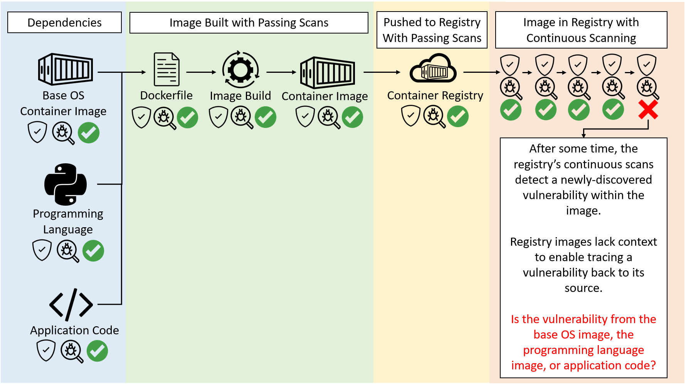

# Image Layer Provenance and Manifest Layer History

## Target Audience

Scanning images turns up an **overwhelming** number of vulnerabilities.
Image maintainers and vulnerability responders are only interested in **actionable** vulnerabilities and want to differentiate alerts between:

* Actionable for vulnerabilities the user can actually fix in their layers, such as vulnerabilities introduced through Dockerfile `ADD, RUN, or COPY` instructions.
* Vulnerabilities in dependent base image layers requiring further action, such as (1) patching the base image, and (2) rebuilding to pull the patched dependencies.

Additionally, current container image formats and vulnerability scan reports do not show the "provenance" (origin) of a vulnerable package (i.e., "how" a vulnerable package got into the image).

* Complex CI/CD pipelines, multiple build engineering systems, and distributed teams are present in today's IT landscape.
* Without vulnerability provenance (origin), responders and maintainers cannot easily determine which build step, repo, specific Dockerfile instruction, or team introduced the vulnerability.

## Problem

### Unable to Trace Vulnerabilities to Source

**Today's image build tools and CI/CD pipelines scan container images for vulnerabilities before, during, and after build.**

**For newly-built images containing up-to-date dependencies and packages, build-time scanners usually are NOT able to detect vulnerabilities during image build.**
**This is because the packages in the image being built are new and up-to-date, with no known vulnerabilities yet.**

**In this case, images are built and pushed to registries with passing scans, even if these up-to-date packages contain undiscovered vulnerabilities.**

**After the image is successfully built and pushed, an open source CVE may be discovered weeks after the push. When the image (now in the registry) is scanned again, scanners would report the new vulnerability.**

**However, registry images do not contain build context and build provenance metadata.**
**The registry scanners are unable to trace vulnerabilities in registry images back to the source.**

**The reported image vulnerability does not differentiate between:**

* **actionable vulnerabilities the image maintainer can immediately fix, such as vulnerabilities in their own application code,**
* **vulnerabilities from dependencies, such as base OS or language runtimes, requiring coordination with upstream dependencies for a fix.**

**Additionally, due to registry images lacking build provenance metadata, it is impossible to trace a registry image back to its source publishing workflow, CI/CD build-publish pipeline, and source git repo.**



### Missing Build Provenance

**After an image is built and pushed to the registry, _REGISTRY IMAGES (POST-BUILD and POST-PUSH to a registry)_ do not contain build provenance information.**

**As such, when a vulnerability is detected within a _REGISTRY IMAGE (POST-BUILD and POST-PUSH to a registry)_, scanners cannot trace the vulnerability back to source.**

Lack of build provenance in registry image formats prevent the following from being answered:

* Did the vulnerability come from application code layers the user introduced, or from one of the base images referenced in a FROM statement?
* Is a patched base image available?
* If the vulnerability did not come from a base image, was it from application layers the user introduced through their own Dockerfile instructions such as `RUN, ADD, or COPY`?
* If so, which **exact** Dockerfile instruction (such as `COPY vuln-pkg ...` or `RUN pip install vuln-pkg`) introduced the vulnerability?
* Who or what entity authored the image config (e.g. who authored the overall image's Dockerfile)?
Who built and published the overall image?

### Limitations of Vulnerability Scan Reports

Vulnerability scanners for container images detect vulnerabilities in OS components (ex. Ubuntu/RHEL packages & binaries) and programming language dependencies (ex. npm/pip packages).
Scanners also determine and report the exact container image layer a vulnerability was introduced.

However, current container image formats (including Docker images) and SBOMs do not include provenance metadata for dependencies and base images.


This prevents scanners from tracing detected vulnerabilities and vulnerable layers in registry images back to source code. Missing accompanying provenance metadata prevents tracing back to the exact base image ref or Dockerfile line that introduced the vulnerability.

### Limitations of SBOMs

SBOMs list the entire list of binaries and packages present in a container image.

However, they only map binaries/packages that are present in each image filesystem layer.
They do not map binaries/packages to source of origin.

It is possible to include build provenance in SBOMs, but that complicates SBOM schemas and contradicts an SBOM's purpose with regards to the Unix philosophy (each file format should do one thing, and do it well).
An SBOM's purpose is to list contents, not be stuffed with a complicated schema that includes logic for source of origin.

Having a purpose-built provenance document that maps image layer to source of origin simplifies the schema for SBOMs.
It also ensures supply chain artifacts (both provenance documents and SBOMs) adhere to the Unix philosophy.


### Additional Info on Current Limitations

Please see [Current Limitations in Container Image Vulnerability Experience](./docs/current-limitations.md).

## Scope

**This provenance specification aims to improve vulnerability traceability for REGISTRY IMAGES only.**
**Registry images are images already built and pushed to a registry that, today, do not contain provenance metadata.**

This spec will cover images built from common OCI-compliant build tools.
However, images originating from buildkit/Dockerfiles are the most common in the ecosystem.
As such, provenance metadata examples illustrated in the repo are Dockerfile/buildkit-specific.

## Goals

* **Enable registry image scanners (such as Qualys, Trivy, etc.) to generate actionable vulnerability reports by using the provenance documents of scanned registry images.**
  * **By utilizing provenance metadata, the actionable vulnerability reports generated by registry image scanners should differentiate vulnerabilities that are (1) actionable in dependent base images or (2) actionable in application code introduced by the image maintainer.**
  * **By utilizing provenance metadata, the generated vulnerability report should include correct attribution for the image vulnerability's fix and action item.**
* Decrease steps to investigate vulnerability source for vulnerabilities detected in registry images.
* Determine the exact locations within image config files (such as Dockerfile references) that require action to fix vulnerabilities detected in registry images.
* Ability to map OCI image filesystem layers to source of origin (base image reference, git commit, Dockerfile, etc.)
* Decrease time to mitigate for vulnerabilities detected in registry images.
* Mapping binaries/packages to source of origin.
  * The OCI image layer format (filesystem diffs) and SBOMs already map binaries/packages to specific filesystem layers.
  * The provenance specification will map filesystem layers to source of origin.
  * When an SBOM is used with a provenance document, binaries/packages can be mapped to source of origin.

## Non-Goals

* This spec will not cover how common registry image scanners should consume the provenance doc in their logic when a vulnerability is detected.
* This spec will not cover image vulnerabilities detected during image build, as common CI/CD should be able to gate and block the image build in such cases.
  * This spec only covers registry image vulnerabilities that are found **after an image is successfully built and pushed to a registry.**
  * This typically happens when a new open source vulnerability is discovered only after an image has been built and pushed to the registry for some time.

## Proposal

At build time, build tools need to generate image build provenance and save provenance metadata alongside the built container image.

### Required Provenance Information for Vulnerability Response

The following provenance information should be present in **registry images** to ensure rapid vulnerability response.

| Provenance Info Required | Requirement Reason |
|-----|-----|
| Does the image filesystem layer come from a dependent base image? If so, what is the base image ref including registry url, repo, and digest? | This will allow image maintainers to determine if a vulnerability was "inherited" from a base image layer, allowing coordination with upstream base image publishers. |
| Does the image filesystem layer come from application code built on top of base images? If so, what is the image config (git repo/commit, Dockerfile) that created the application code image layer? | This allows maintainers to pinpoint the exact image config (such as Dockerfile instructions) where application code vulnerabilities were introduced. This enables a rapid patch of the image config. |
| The build context that (1) built the filesystem layer into the overall image. What was the build ID, pipeline name, and pipeline URI? | This allows maintainers to trace the exact build job that built and pushed the vulnerable registry image. |
| The entity that built the filesystem layer. For example, what is the producer ID or maintainer email that built a base image layer? | This will allow vulnerability investigators to contact the responsible party for the fix. |
| The entity that authored the overall image's image config (e.g. Dockerfile) and the buld pipelines that built and published the image. | For vulnerabilities in base image dependencies, the overall image owner should still be notified so that they can pull patched images (once available), rebuild, and push a newer image. |


### Proposed Provenance Document Format

The proposal is to generate an In-Toto v0.1 Statement with a SLSA Provenance v0.2 Predicate.

The provenance schema will attest build provenance facts for each layer of a container image, mapping a layer to its source of origin.

* The schema is an array of In-Toto Statements.
* Each JSON array element below attests build provenance facts **for a single layer only**.

```
[
  {
  // Provenance statement attesting the build provenance of layer 1
  // – attesting how the first layer of the image was built OR which base image it was inherited from.
    "_type": "https://in-toto.io/Statement/v0.1",
    "subject": [
      {
        "name": "Digest of image layer 1",
        "digest": { "sha256": "Digest of image layer 1" }
      }
    ],
    "predicateType": "https://slsa.dev/provenance/v0.2",
    "predicate": {
      "builder": {
        "id": "Build pipeline URI."
      },
      "buildType": "Type of image build, such as 'dockerfile-build', 'buildkit-build', 'bazel-build', etc.",
      "invocation": {
        "configSource": {
          "uri": "URI to Git repo of image config. For Dockerfile builds, this is a git URI to the Dockerfile (e.g. github.com/org/repo/tree/main/Dockerfile)",
          "digest": {
            "commit": "Git commit SHA that kicked off the image build."
          },
          "entryPoint": "Path to image config in the repo (e.g. path/to/Dockerfile)"
        },
        "parameters": {
          "LayerHistory": {
            "LayerDescriptor": {
              "mediaType": "application/vnd.docker.image.rootfs.diff.tar.gzip",
              "digest": "Layer digest, such as sha256:1efc27...",
              "size": 31366757 // layer size
            },
            "LayerCreationParameters": {
            // * LayerCreationParameters contains layer creation metadata specific to the build type.
            // * E.g. for Dockerfile builds:
              "DockerfileLayerCreationType": "...",
              // * DockerfileLayerCreationType can be one of the following:
              //     FROM-PrimaryBaseImageLayer --> inherited from base image layers
              //     COPY-FromMultistageBuildStageLayer --> created by `COPY --from` multistage build command
              //     COPY-CommandLayer --> created by a plain COPY command
              //     ADD-CommandLayer --> created by the ADD instruction
              //     RUN-CommandLayer --> created by the RUN instruction
              "BaseImage": "null if not from a base image, else 'registry.io/base-image@digest'",
              "DockerfileCommands": [
                {
                  "Cmd": "The Dockerfile instruction command, such as FROM, ADD, COPY, RUN, etc.",
                  "SubCmd": "",
                  "Json": true|false, whether the instruction was written in JSON form,
                  "Original": "The original instruction in source, such as 'FROM docker.io/library/postgres:14-bullseye'",
                  "StartLine": 30,
                  // * Original source line number that starts this command
                  "EndLine": 30,
                  // * The original source line number that ends this command
                  "Flags": [],
                  // * Any flags such as `--from=...` for multistage `COPY` commands.
                  "Value": [
                  // * The command's value args, e.g. for the FROM command: 'registry/repository:digest'.
                    "docker.io/library/postgres:14-bullseye"
                  ]
                }
              }
            ],
            "AttributedEntity": {
            // AttributedEntity is a free-schema JSON-object for
            // maintainers to include attribution
            // information (email, ID, etc.).
            // AttributedEntity contains the entity responsible
            // for the vulnerabilities associated with this layer.
            // E.g. if the layer came from a base image,
            // then this contains the base image maintainer's details.
            // E.g. if the layer was created from a Dockerfile
            // instruction (not from a base image),
            // then this contains the Dockerfile maintainer's details.
            }
          }
        }
      },
      "metadata": {
        "buildInvocationID": "Build pipeline ID number",
        "buildStartedOn": "2022-08-15T18:43:02.436383968-07:00",
        "buildFinishedOn": "2022-08-15T18:43:02.436383968-07:00",s
        "completeness": {
          "parameters": false,
          "environment": false,
          "materials": false
        },
        "reproducible": false
      }
    }
  },
  {
  // Provenance for image layer 2.
    "_type": "https://in-toto.io/Statement/v0.1",
    "subject": [
      {
        "name": "Digest of image layer 2",
        "digest": { "sha256": "Digest of image layer 2" }
      }
    ],
    "predicateType": "https://slsa.dev/provenance/v0.2",
    "predicate": { (same layer provenance schema as above) } 
  },
  {
  // Provenance for image layer 3.
    "_type": "https://in-toto.io/Statement/v0.1",
    "subject": [
      {
        "name": "Digest of image layer 3",
        "digest": { "sha256": "Digest of image layer 3" }
      }
    ],
    "predicateType": "https://slsa.dev/provenance/v0.2",
    "predicate": { (same layer provenance schema as above) } 
  },
  // ...
  // ...
  // ...
  // ...
  {
  // Provenance for image layer N.
  // NOTE: The owner for the last layer is the owner of the overall image.
  // This is because the overall image builder bakes in the last layer of a container image.
    "_type": "https://in-toto.io/Statement/v0.1",
    "subject": [
      {
        "name": "Digest of image layer N",
        "digest": { "sha256": "Digest of image layer N" }
      }
    ],
    "predicateType": "https://slsa.dev/provenance/v0.2",
    "predicate": { (same layer provenance schema as above) } 
  }
]
```

### Proposed Generation and Storage of Image Provenance

At build time, build tools and CI/CD pipelines should add a step that generates a provenance metadata document.
This provenance document should then be pushed to the image's registry as an [OCI Reference Artifact (Referrers API)](https://github.com/opencontainers/distribution-spec/blob/main/spec.md#listing-referrers) to the image.

Storing it at the same location as the image:

* enables easy inspection of image provenance
* enables seamless experience during vulnerability investigations
* simplifies image import workflows, such as copying an image and its associated reference artifacts (including the provenance doc) from one registry to another.


The `artifactType` of the referrer provenence document is still to be determined pending discussions.


### Proposed Organizational-Wide Provenance Guidelines

A provenance document should be attached to every image within an organizations container registries.

**NOTE: Note how each provenance document is generated by utilizing information found in base image provenance documents.**


If the base OS image is imported from an external registry (imported from external registry and cached in an internal registry), a special provenance document will be attached to the externally-imported image.


### Examples of the Proposed Formats

Please check out the [examples](./examples/) directory.
For each example in the examples directory, the following is showcased:

* The original source Dockerfile used to build the image.
* The OCI Image Manifest JSON of the image.
* Provenance document examples that map image layer to source of origin.

## Provenance Document Consumer

### Primary Target Consumer

To limit the scope of this spec in tackling the main problem (generating actionable vulnerability scan reports), the primary consumer/customers of the provenance document will be image vulnerability scanners (Qualys, Trivy, Registry Vulnerability Scanners).

When a vulnerability is found, scanners detect and identify the image layer where the vulnerability was introduced.

Current vulnerability scanners present information such as the following example.
Take note: the vulnerability scan report is unactionable in its current form.
It does not indicate where or how the `linsqlite3-0` vulnerability was introduced to the registry image.

```
Vulnerability Name: Ubuntu Security Notification for Sqlite3 Vulnerabilities (USN-2698-1)

Vulnerable Package Information:
{
  "VulnerablePackages": [
    {
      "name": "libsqlite3-0",
      "installedVersion": "3.8.2-1ubuntu2",
      "requiredVersion": "3.8.2-1ubuntu2.1"
    }
  ]
}

Layer information where the vulnerable package was introduced:

{
 "packageMapping": [
    {
      "packageName": "libsqlite3-0",
      "packageVersion": "3.8.2-1ubuntu2",
      "layers": [
        {
          "layerId": 1,
          "layerHash": "fef0f9958347a4b3c846fb8ea394fbcc554ec5440c7ec72b09786230d55ccc03",
          // * No indication whether the vulnerable package or layer
          //    was introduced by a dependent base image
          //    or from app code introduced by the image maintainer.
          "layerCommand": "ADD file:0a5fd3a659be172e86491f2b94fe4fcc48be603847554a6a8d3bbc87854affec in /"
          // * Mangled layer command history due to image history limitations.
          // * No indication whether the Dockerfile instruction
          //    was from a base image's build instructions
          //    or from the maintainer's own
          //    image config directives (e.g. Dockerfile instructions).
        }
      ]
    }
  ]
}
```

By utilizing the information found in provenance documents, registry scanners would be able to generate a vulnerability report containing actionable insights, such as the following example:

```
Vulnerability Name: Ubuntu Security Notification for Sqlite3 Vulnerabilities (USN-2698-1)

Vulnerable Package Information:
{
  "VulnerablePackages": [
    {
      "name": "libsqlite3-0",
      "installedVersion": "3.8.2-1ubuntu2",
      "requiredVersion": "3.8.2-1ubuntu2.1"
    }
  ]
}

Layer information where the vulnerable package was introduced:

{
 "packageMapping": [
    {
      "packageName": "libsqlite3-0",
      "packageVersion": "3.8.2-1ubuntu2",
      "layers": [
        {
          "layerId": 1,
          "layerHash": "fef0f9958347a4b3c846fb8ea394fbcc554ec5440c7ec72b09786230d55ccc03",
          "layerCommand": "ADD file:0a5fd3a659be172e86491f2b94fe4fcc48be603847554a6a8d3bbc87854affec in /"
          // * ADDITIONAL PROVENANCE GENERATED FROM IMAGE PROVENANCE DOC:
          "layerProvenance": {
            "origin": "FROM-base-image-cmd, COPY-cmd, ADD-cmd, RUN-cmd",
            "baseImage": null OR "registry.io/image@digest",
            "originalSourceCmd": "FROM registry.io/image@digest, COPY file /, RUN apt install pkg",
            "imageSource": {
              "url": "github.com/org/repo/tree/main/Dockerfile",
              "commit": "digest",
              "lineNumbers": "3-4",
            },
            "attributedEntity": "maintainer@example.com"
          }
        }
      ]
    }
  ]
}
```

### Secondary Target Consumer

Image builders/maintainers and vulnerability investigators rely on the vulnerability reports generated by registry image scanners.

By enabling registry image scanners to generate actionable vulnerability reports, these secondary consumers will indirectly benefit from the provenance documents.

### Proof of Concept CLI Tool

A proof of concept CLI tool was developed to showcase the feasibility of generating (at build time) the full build provenance for each image layer.

This is a command-line tool that shows the _**exact**_ Dockerfile commands that created each [OCI Image Manifest](https://github.com/opencontainers/image-spec/blob/main/manifest.md) layer of a container image.

#### Install

To install, run the following commands.

```bash
curl -LO https://github.com/johnsonshi/image-manifest-layer-history/releases/download/v0.0.3/image-layer-dockerfile-history
chmod +x image-layer-dockerfile-history
sudo mv image-layer-dockerfile-history /usr/local/bin
```

#### Generate Image and Image Layer Provenance

Generate a history file that shows the exact Dockerfile commands that created each OCI Image Manifest layer of a container image.

#### Generate – Usage

```bash
image-layer-dockerfile-history \
  generate \
  --username "$registry_username" \
  --password "$registry_password" \
  --image-ref "$image_ref" \
  --dockerfile "$dockerfile" \ # Path to Dockerfile that was used to build the image.
  --output-file "layer-history-slsa.json" \
  --slsa-provenance-json=true
```

See [`./scripts/generate-history-all-examples.sh`](./scripts/generate-history-all-examples.sh) for more examples on Proof of Concept CLI usage.

## Next Steps

### Work Unlocked

* Identifying the base image reference of vulnerabilities enables automated bots (like Dependabot and Renovatebot) to automatically monitor and pull in new base images once they are available.
This would automatically resolve vulnerabilities introduced through base images.
* Identifying the exact image config (e.g. git repo/commit, Dockerfile line) enables automated bots and human investigators to pinpoint the exact location required for a fix.
* Identifying the exact source of origin enables vulnerability investigators to assign incident ownership to the correct responsible party.
* Differentiating between base image vulnerabilities (actionable by base image maintainers) and application code vulnerabilities (actionable by image maintainers) decreases noise from registry scanners.

### Parallel Work

Docker and BuildKit have proposals to include base image information and build provenance within the container image format itself:

* https://github.com/docker/roadmap/issues/243
* https://github.com/moby/buildkit/issues/2756

### For Issues or Suggestions

Please open a GitHub issue.

### Pending Items

* Determine the exact OCI Artifact Type for the provenance document.
* Should layer provenance be stored as:
  1. an array of In-Toto Provenance Statements all within a single OCI artifact?
  2. separate OCI Artifacts for each layer's In-Toto Provenance Statement?
