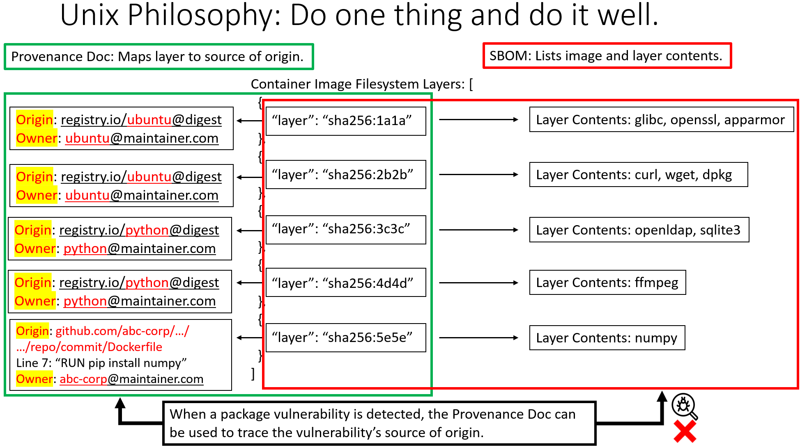
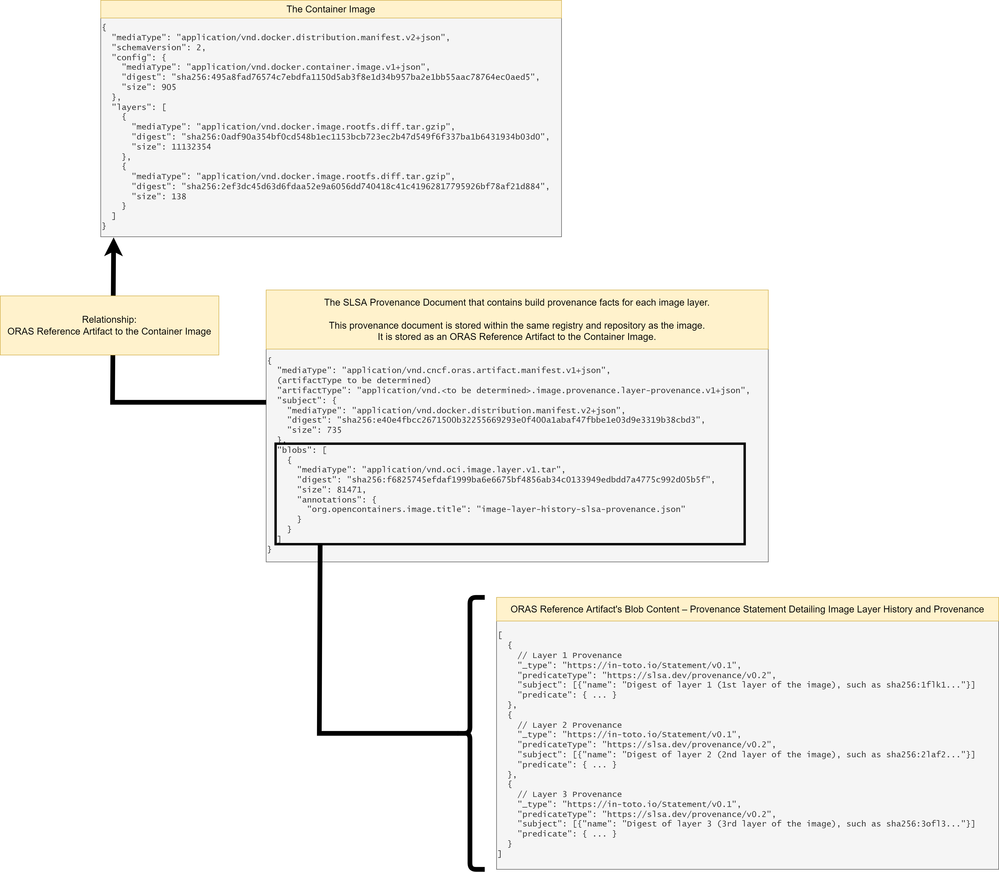

# Image Layer Provenance and Manifest Layer History

## Target Audience

Scanning images turns up an **overwhelming** number of vulnerabilities.
Image maintainers and vulnerability responders are only interested in **actionable** vulnerabilities and want to differentiate alerts between:

* Actionable for vulnerabilities the user can actually fix in their layers, such as vulnerabilities introduced through Dockerfile `ADD, RUN, or COPY` instructions.
* Vulnerabilities in dependent base image layers requiring further action, such as (1) patching the base image, and (2) rebuilding to pull the patched dependencies.

Additionally, current container image formats and vulnerability scan reports do not show the "provenance" (origin) of a vulnerable package (i.e., "how" a vulnerable package got into the image).

* Complex CI/CD pipelines, multiple build engineering systems, and distributed teams are present in today's IT landscape.
* Without vulnerability provenance (origin), responders and maintainers cannot easily determine which build step, repo, specific Dockerfile instruction, or team introduced the vulnerability.

## Problem

### Unable to Trace Vulnerabilities to Source

Today's image build tools and CI/CD pipelines scan container images for vulnerabilities before, during, and after build.
When there are no vulnerabilities, images are built and pushed to registries with passing scans.

After the image is successfully built and pushed, a new CVE or vulnerability may be discovered days or weeks after the push. When the image (now in the registry) is scanned again, scanners would report the new vulnerability.

However, due to missing build provenance metadata, the scanners are unable to trace vulnerabilities in registry images back to the source.
The reported image vulnerability does not differentiate between:

* actionable vulnerabilities the image maintainer can immediately fix, such as vulnerabilities in their own application code,
* vulnerabilities from dependencies, such as base OS or language runtimes, requiring coordination with upstream dependencies for a fix.


### Missing Build Provenance

Lack of build provenance in registry images prevent the following from being answered:

* Did the vulnerability come from application code layers the user introduced, or from one of the base images referenced in a FROM statement?
* Is a patched base image available?
* If the vulnerability did not come from a base image, was it from application layers the user introduced through their own Dockerfile instructions such as `RUN, ADD, or COPY`?
If so, which **exact** Dockerfile instruction (such as `COPY vuln-pkg ...` or `RUN pip install vuln-pkg`) introduced the vulnerability?

### Limitations of Vulnerability Scan Reports

Vulnerability scanners for container images detect vulnerabilities in OS components (ex. Ubuntu/RHEL packages & binaries) and programming language dependencies (ex. npm/pip packages).
Scanners also determine and report the exact container image layer a vulnerability was introduced.

However, current container image formats (including Docker images) and SBOMs do not include provenance metadata for dependencies and base images.


This prevents scanners from tracing detected vulnerabilities and vulnerable layers in registry images back to source code. Missing accompanying provenance metadata prevents tracing back to the exact base image ref or Dockerfile line that introduced the vulnerability.

### Limitations of SBOMs

SBOMs list the entire list of binaries and packages present in a container image.

However, they only map binaries/packages that are present in each image filesystem layer.
They do not map binaries/packages to source of origin.

It is possible to include build provenance in SBOMs, but that complicates SBOM schemas and contradicts an SBOM's purpose with regards to the Unix philosophy (each file format should do one thing, and do it well).
An SBOM's purpose is to list contents, not be stuffed with a complicated schema that includes logic for source of origin.

Having a purpose-built provenance document that maps image layer to source of origin simplifies the schema for SBOMs.
It also ensures supply chain artifacts (both provenance documents and SBOMs) adhere to the Unix philosophy.



### Additional Info on Current Limitations

Please see [Current Limitations in Container Image Vulnerability Experience](./docs/current-limitations.md).

## Scope

This image vulnerability provenance spec will cover all image build types, including images from non-buildkit/Dockerfile originating builds.
However, images originating from buildkit/Dockerfiles are still the most common.
As such, examples illustrated in the repo are Dockerfile/buildkit-specific.

The concept of "Dockerfiles", "base images", and "multi-stage builds" are specific to images from buildkit/Dockerfile-originating builds.
These concepts and dependency semantics are buildkit/Dockerfile-specific, not in [OCI Images](https://github.com/opencontainers/image-spec).

Other OCI-compliant container images built from other tools may not utilize dependency semantics such as "multi-stage builds", "base images", or "Dockerfiles" to build an image.

## Scenarios

**Scenario 1: Suppose the `myapp` image is scanned and a vulnerable package is detected in layer `digest: sha256:5e5e`. All images are built within the organization; no externally imported images.**

From the diagram, the layer containing the vulnerability (layer `digest: sha256:5e5e`) was created by the `myapp` image's Dockerfile instruction (specifically, `COPY file5 /file5` introduced the vulnerability).

**Vulnerability scanners CANNOT pinpoint the exact Dockerfile source (code repo, git ref, Dockerfile instructions) that created the layer.**

This is **not possible** today because the image history format (which scanners rely on) does not contain build context such as:

* the original/preserved Dockerfile instructions
* the Dockerfile source (code repo, git ref, Dockerfile instruction)
* the entity (producer ID, pipeline ID, etc.) that built tha layer


-----

**Scenario 2: Suppose `myapp` image is scanned again, and a vulnerable package is detected in layer `digest: sha256:1a1a`. All images are built within the organization; no externally imported images.**

From the diagram, the layer containing the vulnerability (layer `digest: sha256:1a1a`) originates from the `mariner` base image.

**Due to limitations in image history format, the vulnerability report for the `myapp` image is NOT able to express that the vulnerability originated from the base image and display the layer's originating base image ref.**

This is **not possible** today because the image history format (which scanners rely on) does not indicate whether a layer originates from a base image or store the base image ref.


-----

**Scenario 3: Suppose `bar` image is scanned, and a vulnerable package is detected in layer `digest: sha256:1a1a`. The base OS image is imported from an external registry and not built internally.**

From the diagram, the layer containing the vulnerability (layer `digest: sha256:1a1a`) originates from the `ubuntu` base image.

This `ubuntu` base image was not built internally.
It was imported from an external registry (such as `docker.io/library/ubuntu`) and cached in an internal registry.

**Due to limited image history format, the vulnerability report for the `myapp` image is NOT able to express that the vulnerability originated from the base image and display the layer's originating base image ref.**


## Proposal

At build time, build tools need to generate image build provenance.
Currently, no tools generate such provenance information.
The following provenance information is needed for images to ensure rapid vulnerability response:

* Indication whether an image filesystem layer came from a base image or not.
  * This will allow image maintainers to determine if a vulnerability was "inherited" from a base image layer, allowing coordination with upstream base image publishers.
* Information on the exact (1) Git repo, (2) commit, (3) Dockerfile, and (4) Dockerfile instructions and line numbers that generated each image filesystem layer.
  * This allows maintainers to pinpoint the exact Dockerfile location where a vulnerability is introduced to deliver a rapid patch.
  * Knowing the exact Dockerfile location, automated Dockerfile patch tools (such as Dependabot or Renovate Bot) will be able to patch vulnerable Dockerfile instructions.
    * For example, knowing the exact Dockerfile provenance, a bot can patch `RUN pip install pkg-vuln-version` into `RUN pip install pkg-patched-version`.
* The exact build context (build ID, build pipeline name, build pipeline URI) that generated each image filesystem layer.
* The entity (producer ID, builder ID, maintainer email, etc.) that is responsible for the vulnerabilities and lifecycle of the image.
  * This will allow vulnerability investigators to contact the responsible party for the fix.

### Proposed Provenance Document Format

The proposal is to generate an In-Toto v0.1 Statement with a SLSA Provenance v0.2 Predicate.

The provenance schema will attest build provenance facts for each layer of a container image.

* The schema is an array of SLSA Provenance Statements.
* Each JSON array element below attests build provenance facts **for a single layer only**.

```
[
  {
  // Provenance statement attesting the build provenance of layer 1
  // – attesting how the first layer of the image was built OR which base image it was inherited from.
    "_type": "https://in-toto.io/Statement/v0.1",
    "predicateType": "https://slsa.dev/provenance/v0.2",
    "subject": [
      {
        "name": "Digest of layer 1 (first layer of the image), such as sha256:1efc27...",
        "digest": {
          "sha256": "Layer digest without the algorithm, such as 1efc27..."
        }
      }
    ],
    "predicate": {
      "builder": {
        "id": "URI indicating the image builder identity. E.g. pipeline-name"
      },
      "buildType": "URI indicating what type of build was performed. E.g. dockerfile-build",
      "invocation": {
        "configSource": {
          "uri": "URI to Git repo of image's build source. For example, for Dockerfile builds, this describes where the Dockerfile that kicked off the build came from. E.g. https://www.github.com/example/reponame/blob/master/Dockerfile". For non-Dockerfile builds, this is a Git URL to the image build source (Bazel image config, ko image config, etc.),
          "digest": {
            "commit": "Git commit SHA that kicked off the image build."
          },
          "entryPoint": "Path to image build source in the repo (such as path/to/Dockerfile or path/to/bazel-cfg)."
        },
        "parameters": {
          "LayerHistory": {
            "LayerDescriptor": {
              "mediaType": "application/vnd.docker.image.rootfs.diff.tar.gzip",
              "digest": "Layer digest, such as sha256:1efc27...",
              "size": 31366757 // layer size
            },
            "LayerCreationType": "Dockerfile/BuildKit, Bazel, ko, etc.",
            "LayerCreationParameters": {
            // LayerCreationParameters contains layer creation metadata specific to the build type.
            // For example, for Dockerfile/BuildKit originating builds, it contains the following:
              "DockerfileLayerCreationType": "...",
              // DockerfileLayerCreationType can be one of the following:
              // FROM-PrimaryBaseImageLayer          // for layers inherited from base image layers
              // COPY-FromMultistageBuildStageLayer  // for layers created through `COPY --from` multistage build stages
              // COPY-CommandLayer                   // for layers created through a plain COPY instruction
              // ADD-CommandLayer                    // for layers created by the ADD instruction
              // RUN-CommandLayer                    // for layers created by the RUN instruction
              "DockerfileCommands": [
                {
                  "Cmd": "The Dockerfile instruction command, such as FROM, ADD, COPY, RUN, etc.",
                  "SubCmd": "",
                  "Json": false,
                  "Original": "The original instruction in source, such as 'FROM docker.io/library/postgres:14-bullseye'",
                  "StartLine": 30, // the original source line number that starts this command)
                  "EndLine": 30,   // the original source line number that ends this command)
                  "Flags": [],     // Any flags such as `--from=...` for multistage `COPY` commands.)
                  "Value": [       // The contents of the command, such as 'registry/repository:digest' for the FROM command)
                    "docker.io/library/postgres:14-bullseye"
                  ]
                }
              }
            ],
            // If the layer was inherited from a base image layer, 'BaseImage' is populated with the base image reference.)
            "BaseImage": "docker.io/library/postgres:14-bullseye",
            "AttributionAnnotations": null
            // AttributionAnnotations contains the entity responsible
            // for the vulnerabilities associated with this layer.
            // For example, if the layer came from a base image,
            // then this contains the base image maintainer details.
            // For example, if the layer was created from a Dockerfile
            // instruction (not from a base image),
            // then this contains the Dockerfile maintainer details.
          }
        }
      },
      "metadata": {
        "buildInvocationID": "Globally Unique Build Invocation ID. Definition: Identifies this particular build invocation, which can be useful for finding associated logs or other ad-hoc analysis. The exact meaning and format is defined by builder.id; by default it is treated as opaque and case-sensitive. The value SHOULD be globally unique.",
        "buildStartedOn": "2022-08-15T18:43:02.436383968-07:00",  // image build start time)
        "buildFinishedOn": "2022-08-15T18:43:02.436383968-07:00", // image build end time)
        "completeness": {
          "parameters": false,
          "environment": false,
          "materials": false
        },
        "reproducible": false
      }
    }
  },
  {
  // Provenance statement attesting the build provenance of layer 2
  // – attesting how the second layer of the image was built OR which base image it was inherited from.
    "_type": "https://in-toto.io/Statement/v0.1",
    "predicateType": "https://slsa.dev/provenance/v0.2",
    "subject": [
      {
        "name": "Digest of layer 2 (2nd layer of the image), such as sha256:2fes2...",
        "digest": {
          "sha256": "Layer digest without the algorithm, such as sha256:2fes2..."
        }
      }
    ],
    "predicate": {
      // ... // (same schema and contents as above)
    } 
  },
  {
  // Provenance statement attesting the build provenance of layer 3
  // – attesting how the third layer of the image was built OR which base image it was inherited from.
    "_type": "https://in-toto.io/Statement/v0.1",
    "predicateType": "https://slsa.dev/provenance/v0.2",
    "subject": [
      {
        "name": "Digest of layer 3 (3rd layer of the image), such as sha256:3kr7a...",
        "digest": {
          "sha256": "Layer digest without the algorithm, such as sha256:3kr7a..."
        }
      }
    ],
    "predicate": {
      // ... // (same schema and contents as above)
    } 
  }
  // ...
]
```

### Proposed Provenance Document Storage Guidelines

This statement will be attached as an [OCI Reference Artifact](https://oras.land/cli/6_reference_types/) to the image and stored within the same registry and repository.
Storing it at the same location as the image allows (1) easy inspection of image provenance and (2) seamless experience during vulnerability investigations.

Storing the provenance document at the same location (in the registry as an artifact) simplifies image import workflows, such as importing an image to an on-prem or airgapped cloud environment.
All image importers would need to do is to import an image and its associated OCI referrer provenance documents.

The `artifactType` of the referrer provenence document is still to be determined pending discussions.



### Proposed Organizational-Wide Provenance Guidelines

A layer history provenance document will be attached to every image within the organization's registries.


If the base OS image is imported from an external registry (imported from external registry and cached in an internal registry), a special provenance document will be attached to the externally-imported image.


### Examples of the Proposed Formats

Please check out the [examples](./examples/) directory.
For each example in the examples directory, the following is showcased:

* The original source Dockerfile used to build the image.
* The OCI Image Manifest JSON of the image.
* The limited layer history of the image (obtained from `docker image history` output).
* The SLSA Provenance document that details the FULL layer history and provenance for each layer of the image (filename: `oci-image-manifest-layer-history-slsa.json` within each example directory).

## Provenance Document Consumer

### Primary Target Consumer

To limit the scope of this spec in tackling the main problem (generating actionable vulnerability scan reports), the primary consumer/customers of the provenance document will be image vulnerability scanners (Qualys, Trivy, Registry Vulnerability Scanners).

When a vulnerability is found, scanners detect and identify in which image layer was the vulnerability added/modified.
(1) Each image layer has a unique hash and (2) the document format shows the provenance for each layer based on the unique hash.

Because of this, vulnerability scanners can use the unique hash to augment vulnerability reports with provenance information to make scan results actionable.

Current vulnerability scanners present information such as the following example:

```
Vulnerability Name: Ubuntu Security Notification for Sqlite3 Vulnerabilities (USN-2698-1)

Vulnerable Package Information:
{
  "VulnerablePackages": [
    {
      "name": "libsqlite3-0",
      "installedVersion": "3.8.2-1ubuntu2",
      "requiredVersion": "3.8.2-1ubuntu2.1"
    }
  ]
}

Layer information where the vulnerable package was introduced:

{
 "packageMapping": [
    {
      "packageName": "libsqlite3-0",
      "packageVersion": "3.8.2-1ubuntu2",
      "layers": [
        {
          "layerId": 1,
          "layerHash": "fef0f9958347a4b3c846fb8ea394fbcc554ec5440c7ec72b09786230d55ccc03",
          ^^^ Unique layer hash digest
          ^^^ (1) no indication if this layer came from a base image
                  or from newly-added layers on top of base image.
          ^^^ (2) IF it came from a base image, no info on
                  the base image's registry url, repo, digest.
                  Also no indication if the base image was
                  externally-imported from another registry,
                  or was built by another team within an
                  organization.
          ^^^ (3) IF it came from an additional Dockerfile-cmd,
                  no info on code url, commit, Dockerfile path,
                  Dockerfile line numbers, etc.
          "layerCommand": "ADD file:0a5fd3a659be172e86491f2b94fe4fcc48be603847554a6a8d3bbc87854affec in /"
        }
                           ^^^ (1) no indication if this instruction
                                   was from a base-image's Dockerfile or the image's own Dockerfile.
                           ^^^ (2) the Dockerfile cmd is mangled.
      ]
    }
  ]
}
```

With information in the provenance document, an following actionable report, such as the following example (just an example – not part of the spec) can be generated:

```
Vulnerability Name: Ubuntu Security Notification for Sqlite3 Vulnerabilities (USN-2698-1)

Vulnerable Package Information:
{
  "VulnerablePackages": [
    {
      "name": "libsqlite3-0",
      "installedVersion": "3.8.2-1ubuntu2",
      "requiredVersion": "3.8.2-1ubuntu2.1"
    }
  ]
}

Layer information where the vulnerable package was introduced:

{
 "packageMapping": [
    {
      "packageName": "libsqlite3-0",
      "packageVersion": "3.8.2-1ubuntu2",
      "layers": [
        {
          "layerId": 1,
          "layerHash": "fef0f9958347a4b3c846fb8ea394fbcc554ec5440c7ec72b09786230d55ccc03",
          "layerCommand": "ADD vulnerable-binary in /",
                           ^^^ unmangled history
          // additional provenance:
          "layer-provenance": {
            "origin": "inherited from base image" OR "newly-added layer from Dockerfile instruction",
            "base-image": null OR "example-registry.com/repo@digest",
            "Dockerfile instruction": "FROM abc.io/image@digest" or "COPY a /a" ...,
            "Dockerfile source": {
              "url": "repo.com/org/code-repository/tree/main/Dockerfile",
              "commit": "commit-sha",
              "Dockerfile line numbers": "3-4",
            }
          }
        }
      ]
    }
  ]
}
```

### Secondary Target Consumer

Secondary consumers of this document are image builders, image maintainers, or whoever is responsible within an organization to respond to vulnerability scan results.
These users are some of the consumers of scan results.

By augmenting vulnerability scan results with actionable information, these secondary consumers will benefit.

### Proof of Concept CLI Tool

A proof of concept CLI tool was developed to showcase the feasibility of generating (at build time) the full build provenance for each image layer.

This is a command-line tool that shows the _**exact**_ Dockerfile commands that created each [OCI Image Manifest](https://github.com/opencontainers/image-spec/blob/main/manifest.md) layer of a container image.

#### Install

To install, run the following commands.

```bash
curl -LO https://github.com/johnsonshi/image-manifest-layer-history/releases/download/v0.0.2/image-layer-dockerfile-history
chmod +x image-layer-dockerfile-history
sudo mv image-layer-dockerfile-history /usr/local/bin
```

#### Generate Image and Image Layer Provenance

Generate a history file that shows the exact Dockerfile commands that created each OCI Image Manifest layer of a container image.

#### Generate – Usage

```bash
image-layer-dockerfile-history \
  generate \
  --username "$registry_username" \
  --password "$registry_password" \
  --image-ref "$image_ref" \
  --dockerfile "$dockerfile" \ # Path to Dockerfile that was used to build the image.
  --output-file "layer-history-slsa.json" \
  --slsa-provenance-json=true
```

See [`./scripts/generate-history-all-examples.sh`](./scripts/generate-history-all-examples.sh) for more examples on Proof of Concept CLI usage.

## Next Steps

### Work Unlocked

Vulnerability scanners and automated bots (like Dependabot, Renovate Bot) 

### Parallel Work

### For Issues or Suggestions

Please open a GitHub issue.

### Pending Items

* Determine the exact ORAS Artifact Type for the provenance document.
* Should layer provenance be stored as:
  1. an array of In-Toto Statements (containing SLSA Layer Provenance)all within a single ORAS artifact?
  2. separate ORAS Artifacts for each layer's In-Toto Statement (containing SLSA Layer Provenance)?
